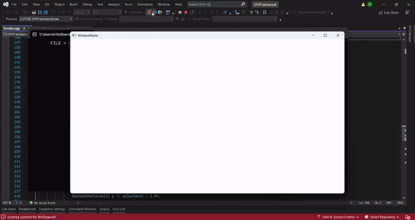

# Tank Wars Game

> A thrilling 2D 1v1 tank battle game built in C++ with `OpenGL`.

## Preview

## Tank Color Selection (UI)

Players are initially prompted with a UI to choose their tank colors:
- Player 1 can change the color using `W`/`S` on the left side.
- Player 2 can change the color using `↑`/`↓` on the right side.

A white rectangle highlights the selected color option. 
The default colors are at the bottom. 

Both players have limited time to make their selection, after which the 
tanks will appear in their chosen colors. To skip the selection, press `Enter`.

> Each tank will have a unique color, ensuring players can easily tell them apart.

Once the color selection is complete, the game begins!

## 1v1 Gameplay

The game takes place on a dynamic terrain with valleys and hills, 
where two tanks battle it out. Players can shoot each other, 
and every time a player is hit, their health decreases. 
The hit area will flash red, and the health bar above the tank 
will update accordingly.

Additionally, each tank will display a trajectory line to help aim 
during shooting.

The first player to lose all their health will lose the game, 
and a smooth transition effect will play:
- From left to right and back
- From right to left and back
- From top to bottom and back
- From bottom to top and back

At each game reset, a random terrain is selected, and tanks 
are respawned with full health, just as they were at the start.

## Terrain Design

The terrain is shaped using a *sinusoidal* function built from three 
`alpha * sin(omega * x)` waveforms, with an added offset.

Each game session features a random terrain selected from a pool. 
Additionally, the terrain is dynamic: whenever a projectile hits, 
it creates a semi-circular hole. The terrain will always remain above zero.

The "landslide" physics mechanic ensures that between two 
consecutive terrain points, the higher point transfers height to 
the lower one, adding to the realism and challenge.

## Idle Players

If there is no input for 20 seconds, both tanks' health will 
decrease continuously. This can be stopped by pressing any of 
the following keys relevant to the game:
(`A`, `B`, `W`, `S`, `SPACE`, `Enter`, `←`, `→`, `↑`, `↓`).

## Key Bindings During Gameplay

Key bindings for Player 1:
- `A`: Move tank left
- `B`: Move tank right
- `W`: Rotate turret counterclockwise
- `S`: Rotate turret clockwise
- `SPACE`: Shoot! (*Launches projectile*)

Key bindings for Player 2:
- `←`: Move tank left
- `→`: Move tank right
- `↑`: Rotate turret counterclockwise
- `↓`: Rotate turret clockwise
- `Enter`: Shoot! (*Launches projectile*)

## The Source Code

### What does my solution offer?

- A clean and elegant **OOP** design that adheres to the [**SOLID**](https://www.digitalocean.com/community/conceptual-articles/s-o-l-i-d-the-first-five-principles-of-object-oriented-design) principles.
- Utilizes `OpenGL` along with the [gfx-framework](https://github.com/UPB-Graphics/gfx-framework), which abstracts much of the complexity so you don't need to fully understand it.

The core implementation for the project can be found in the following directory: 
[src/lab_m1/TankWarsGame/](src/lab_m1/TankWarsGame/).

### What have I learned from developing it?

Some of the biggest lessons I learned from this project were:
1. Structuring code for future extensibility
1. Effectively reading API documentation
1. Troubleshooting/debugging a low-level, memory-instensive language (C++)

